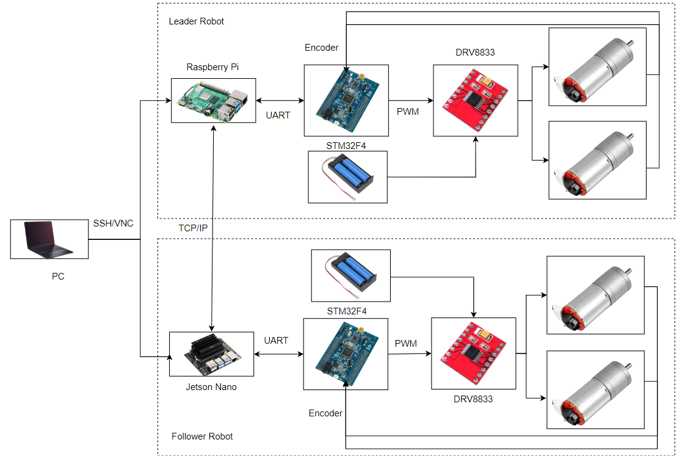

# Mobile Robots Swarm Formation Control System

## Overview

This project involves the design and implementation of a mobile robots system focused on swarm formation control. The system integrates multiple components and technologies to achieve precise and efficient robot coordination and control. Key aspects of the project include:

- **System Overview & Device Selection**: Developing a comprehensive system overview and selecting the appropriate devices to ensure optimal performance and integration.
- **Motor Control Module**: Designing a robust motor control module using STM32F411 microcontroller and DVR8833 driver, with detailed schematics created using Altium Designer.
- **PID Controller for Leader Robot**: Implementing a PID (Proportional-Integral-Derivative) controller for the leader robot, with real-time data collection and visualization through a Qt GUI.
- **Path Planning with PSO**: Simulating and applying the Particle Swarm Optimization (PSO) algorithm to solve path planning problems, ensuring efficient and adaptable route planning.
- **Data Exchange via TCP/IP**: Utilizing TCP/IP through sockets to enable seamless data exchange between robots, facilitating effective communication and coordination.
- **Formation Control Simulation**: Researching and simulating formation control problems to ensure that the robots can maintain desired formations and adapt to dynamic environments.
- **PID Controller for Follower Robot**: Designing and implementing a PID controller for the follower robot to maintain precise distance and alignment with the leader robot.
- 

## Demo

To see the system in action, check out the following demonstrations:

- [Demo 1: Robot Formation Control 1](https://youtu.be/nGleLVJwCFw?si=EQ4eTj2TXlfPAPOJ)
- [Demo 2: Robot Formation Control 2](https://youtu.be/kxA-t1RKV8c?si=lNSHbeRf_flBM_bW)

## Technologies Used

- **Microcontroller:** STM32F411.
- **Motor Driver:** DVR8833.
- **Development Environment:** Altium Designer, Qt GUI, Python,stm32cubeide.
- **Path Planning Algorithm:** Particle Swarm Optimization (PSO).
- **Control Algorithm:** PID control for angular velocity of the leader robot and position control of the follower robot.
- **Communication Protocol:** TCP/IP via Sockets, UART between MCU and Jetson Nano/Raspberry Pi.
- **Synchronization**: Multithreading and semaphores for data synchronization in the follower robot.
- **Data Visualization:** Qt for GUI, Python's matplotlib for plotting.
- **Computing Platforms:** Jetson Nano, Raspberry Pi.

## Installation & Usage

1. **Hardware Setup**: Connect the STM32F411 and cp2102 to USB port of Jetson Nano/ Raspberry Pi.
2. **Software Installation**: Python3, Stm32cubeide versions 1.14, and Altium Designer 21.
3. **Run the System**: Run the Python file for the leader, wait until it has computed the path completely, and then run the follower file..

## Future Enhancements

- Integration with additional sensors or LiDAR and camera for improved obstacle detection. My teammate and I have a low budget, so I can only do this much.
- Enhancement of the path planning algorithm for dynamic environments.
- Expansion of communication protocols to include other network configurations.

## Contact

For further information or questions about the project, please reach out to  this email: nghiahuynthv01042002@gmail.com. 
The report will be updated soon.